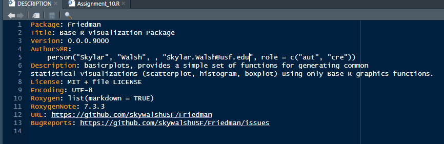
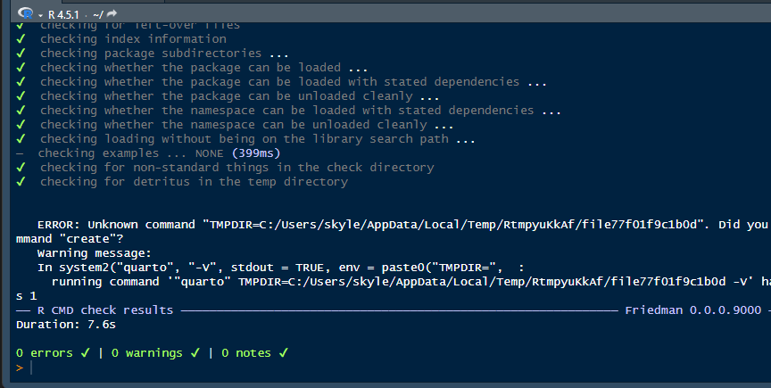
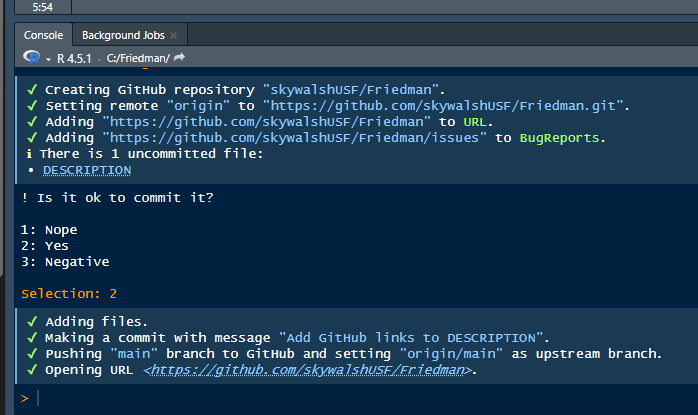
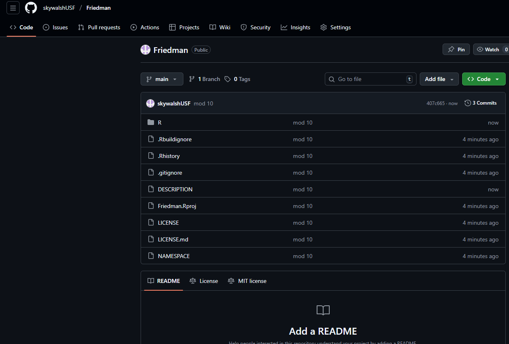

```{r setup, include=FALSE}
knitr::opts_chunk$set(echo = TRUE)
```

```{r}
#| echo: TRUE
#| eval: TRUE
#| file: https://raw.githubusercontent.com/skywalshUSF/Friedman/refs/heads/main/R/Assignment_10.R

```

I propose Base R Visualization Package Idea: simplebaseplots This package will provide simplified wrappers around base R's powerful plotting functions (plot(), hist(), boxplot()) to make them consistent and easy to use for beginners.

The R package, which can be named basicrplots, provides a simple set of functions for generating common statistical visualizations (scatterplot, histogram, boxplot) using only Base R graphics functions. The goal of this package is to offer a lightweight alternative to more complex visualization libraries, making it ideal for beginners learning R, instructors teaching fundamental data visualization concepts without external dependencies, or scenarios where minimal package overhead is desired. The core functions will abstract away some of the repetitive setup code required for standard Base R plots, allowing users to quickly generate publication-ready simple graphs with consistent styling and clear default labeling.

The basicrplots package provides three core functions that generate essential statistical graphics exclusively using Base R capabilities:

basic_scatterplot(x, y, ...): Creates a standard X-Y scatterplot. It accepts two numeric vectors and optional parameters for a custom title, axis labels, and point color. It uses solid points (pch = 19) by default.

basic_histogram(x, ...): Generates a frequency histogram for a single numeric vector. Users can customize the plot title, x-axis label, and the fill color of the bars, offering a quick visual summary of data distribution.

basic_boxplot(formula, data, ...): Produces a box-and-whisker plot. This function is flexible, allowing users to input either a single numeric vector or a formula (y \~ group) to compare distributions across different categories within a data frame. It supports customizations for title, y-axis label, and box color.

This is my descriptions file:

[](desc.png)

I verified that the package was created successfully and that errors were handled.

[](check.png)

Then I confirmed that the package was pushed to a new github repo.

[](gitconf.png)

Here is a link to my github repo:

[](mod10git.png)

<https://github.com/skywalshUSF/Friedman/tree/main>
