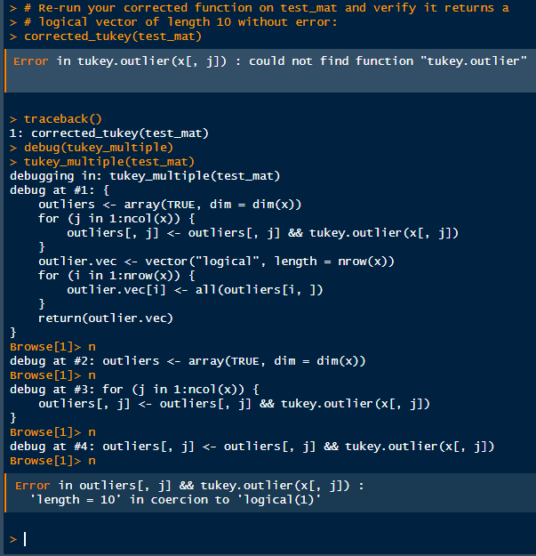
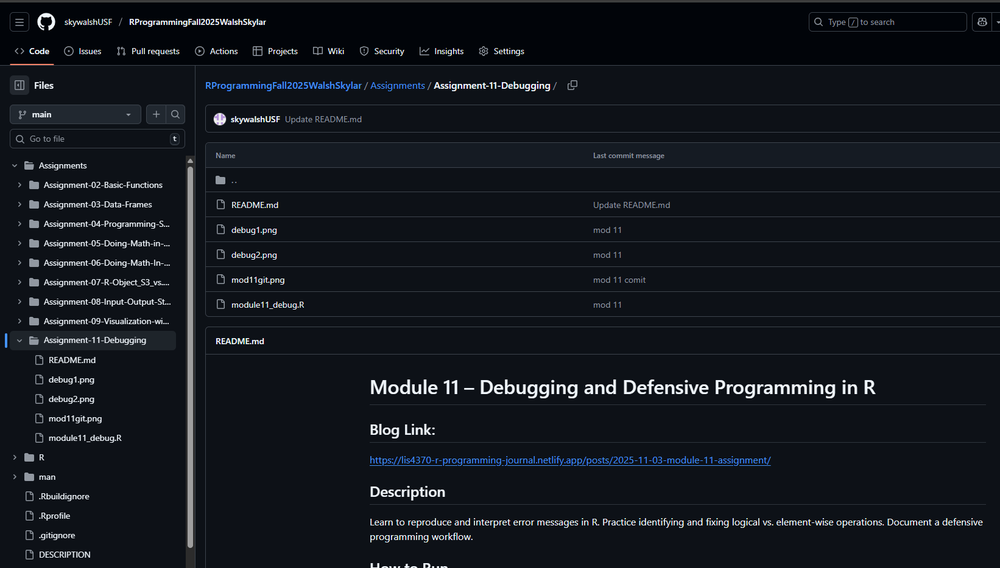

```{r setup, include=FALSE}
knitr::opts_chunk$set(echo = TRUE)
```

Here are my debugging screenshots:

1st

[](debug1.png)

2nd:

[](debug2.png)

```{r}
#| error: TRUE
#| echo: TRUE
#| eval: TRUE
#| file: https://raw.githubusercontent.com/skywalshUSF/RProgrammingFall2025WalshSkylar/refs/heads/main/Assignments/Assignment-11-Debugging/module11_debug.R

```

Here is a link to my github repo:

[](mod11git.png)

<https://github.com/skywalshUSF/RProgrammingFall2025WalshSkylar/tree/main/Assignments/Assignment-11-Debugging>
