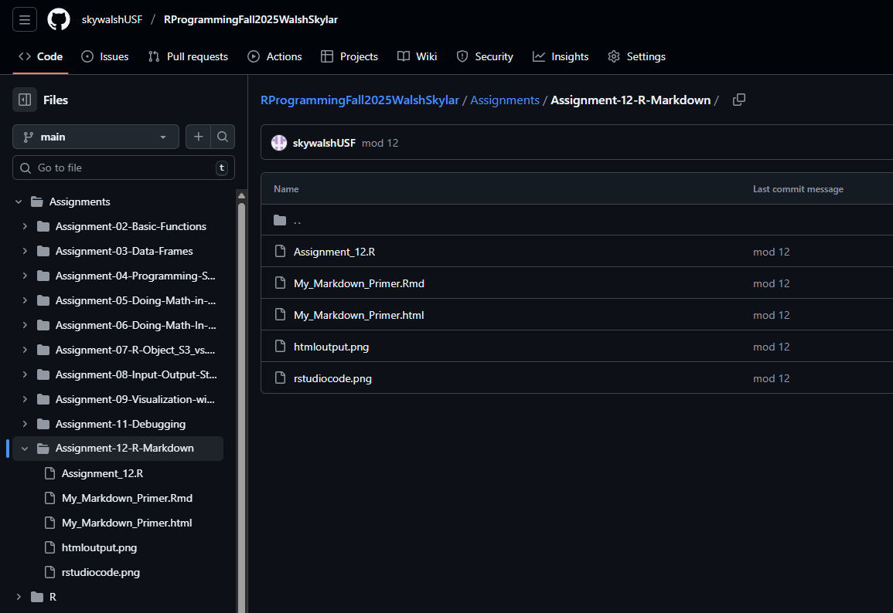
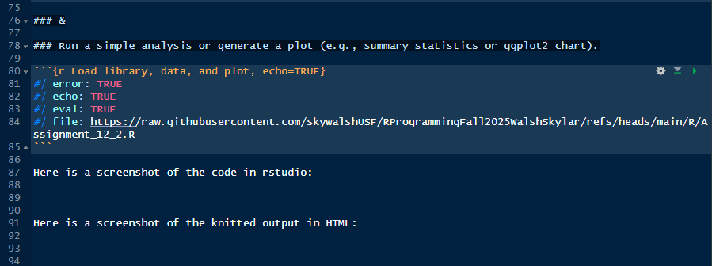

This is my Module 12 blog post for LIS4370.

Here is a link to my github repo:

<https://github.com/skywalshUSF/RProgrammingFall2025WalshSkylar/tree/main/Assignments/Assignment-12-R-Markdown>

[](githubmod12.png)


## Task: 1 - Create an R Markdown File

In RStudio, go to File, New File, R Markdown… and choose HTML output.

Give it a title (e.g., “My R Markdown Primer”) and author metadata.

### I completed this task successfully

## Task: 2 - Populate the Document

### Write sections that include:

### A brief introduction explaining what R Markdown is.

```{r echo=TRUE}
# R Markdown is a document type that has the capability to combine r code and
# many other types of text into one document or file in various formats.

# If I were to create a markdown file in RStudio, it would have a .rmd file and
# some metadata at the top as the head that talks about or gives information
# about the document. I can add text, images, and even links to other webpages
# using HTML, and then add executable chunks of R code that will be run when
# the markdown file is knitted or compiled.
```

### At least one narrative paragraph (Markdown text).

For the following example, I will load the corrplot R package which does not

contain any built-in example datasets of its own. So to use the package, I must

first load a dataset from base R, compute the correlation matrix using the cor()

function, and then pass that matrix to the corrplot() function. The cor() makes

a table of correlations coefficients between the possible pairs of variables

and the corrplot() function creates a nice visualization of the rounded results.

### At least one LaTeX math expression (e.g., inline $alpha + beta = gamma$ and a displayed equation).

This is an inline equation: if $e=mc^2$ then:

for $m = 100$, $c=299,792,458$

$e = 100*299,792,458^2$ is $=8.9875518e+18$

### At least two executable R code chunks that:

### Load a library or dataset.

```{r}
#| error: TRUE
#| echo: TRUE
#| eval: TRUE
#| file: https://raw.githubusercontent.com/skywalshUSF/RProgrammingFall2025WalshSkylar/refs/heads/main/R/Assignment_12_1.R
```

### &

### Run a simple analysis or generate a plot (e.g., summary statistics or ggplot2 chart).

```{r Load library, data, and plot, echo=TRUE}
#| error: TRUE
#| echo: TRUE
#| eval: TRUE
#| file: https://raw.githubusercontent.com/skywalshUSF/RProgrammingFall2025WalshSkylar/refs/heads/main/R/Assignment_12_2.R
```

## Task: 3 - Compile and Review

### Knit the document to HTML (or PDF) and save the output.

### Compare the source .Rmd file side‑by‑side with the rendered output.
### Note any formatting surprises or tips you discovered.

Here is a screenshot of the code in rstudio:

[](rstudiocode.png)

Here is a screenshot of the knitted output in HTML:

[](htmloutput.png)

### A concluding reflection on your experience using R Markdown vs. writing plain reports

In conclusion, the transition from writing plain reports to using R Markdown presents a significant, yet highly advantageous shift in workflow. While the initial hurdle of mastering R Markdown’s syntax, code chunk integration, and output customization presents a notable learning curve that may deter users accustomed to traditional word processors, the long-term benefits far outweigh this initial time investment. R Markdown fundamentally changes the reporting process by enabling the seamless integration of narrative sections, executable code chunks, and their results, all within a single document. This robust framework also fully supports the use of , further enhancing its capabilities for technical documentation. By uniting text, dynamic code, and complex equations, R Markdown produces fully reproducible reports that drastically reduce manual errors. Furthermore, the ability to generate professional quality documents in multiple formats, such as PDF, HTML, and Word, from this single source greatly enhances efficiency and consistency. Ultimately, the commitment required to overcome the initial learning curve is justified by the resulting automation, flexibility, and reproducibility, making R Markdown a superior choice for data science and analytical communication.
