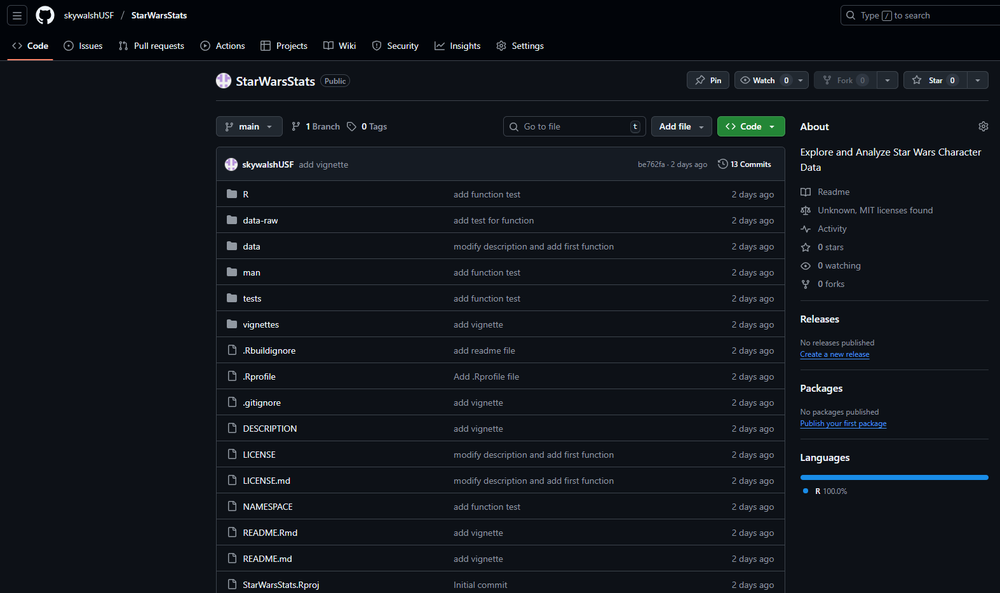
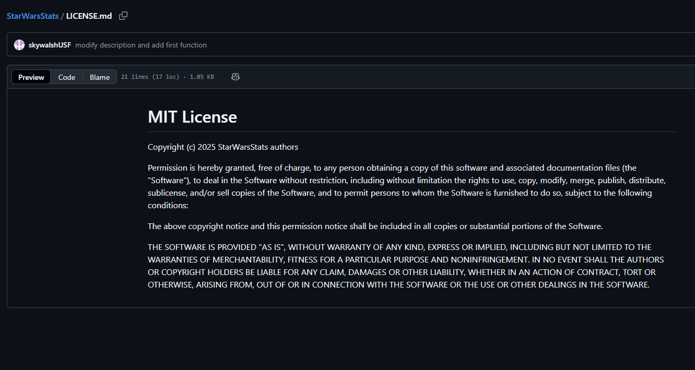

This is my final blog post for LIS4370.

Here is a link to my final project 'StarWarsStats' R Package github repo:

<https://github.com/skywalshUSF/StarWarsStats>

[](finalgithub.png)

## Task: Develop an R package, publish it on GitHub, and share the repository link on Canvas. Package must include all documentation components of modules 10, 11, and 12.

The 'StarWarsStats' package I made is an accessible tool for exploring and manipulating a recognizable built-in dataset in R called 'starwars.' While it is included in the dplyr package, finding certain pieces of information, such as characters born before the Battle of Yavin (BBY), often required me to use complicated filtering code. The package was created to simplify and make sense of this complexity, providing users with simple solutions by creating functions that make Star Wars data analysis more efficient.

The main goal of the 'StarWarsStats' package is to provide specialized and reliable data extraction functions built to support the 'starwars' data in more meaningful ways. This package can generate interest among three primary audiences: R beginners, Data Analysts, and Educators who can use it to learn and demonstrate working with complex list columns in R. My intended goals are to perform reproducible research with an intuitive tool and become more familiar with clean code and data habits.

The process of packaging 'StarWarsStats' provided the most useful hands-on experience in following formal R package standards. This involved structuring the project directory correctly, writing comprehensive and accurate Roxygen documentation that will confirm that all functions exclusive to the package are accessible in R's help() function, and making sure that every function passes without any errors or failures. I had to be well-attuned and cautious to create a package that has effective code quality, documentation, and error handling, turning simple scripts and documentation into a more reusable component.

Several technical challenges were encountered and addressed during development. The most frequent issue was handling execution halts, which occur when R verifies a function's dependencies and then reports an error if a problem is found. Furthermore, handling the complex list columns and columns with missing values (NAs) presented challenges, requiring me to use functions that provided accurate matching and retrieval of related characters and values.

Looking ahead and moving forward, the possibilities for the 'StarWarsStats' package are substantial and limitless, focusing mainly on using a framework for code stability and expanded functionality. Future improvements could include the addition of built-in functions for generating quick visualizations, such as plots that compare average height by species or a bar chart of the most frequent hair colors. The package itself could also be expanded to include tools for working with other data sets. The future of this dataset could be prosperous in data analyses that are both entertaining and educational.

## Overall Introduction of the StarWarsStats Package

The goal of this R Package is to provide a set of utility functions to easily load, filter, validate, and analyze data from the ‘dplyr::starwars’ data set, focusing on character attributes, names, heights, genders, and associated starships. The package offers robust, well-documented examples of R programming techniques, including ‘dplyr’ wrangling, input validation, and error handling within a fun, accessible domain. It was created as an educational exercise to demonstrate practical R function-writing and documentation standards and is primarily intended for students learning R programming who want hands-on examples of data manipulation and ofbuilding reusable functions within validation checks.

## Installation

Since this package is not yet on CRAN, you can install the development version directly from GitHub using the ‘remotes’ package.

### Prerequisites

You must have the following packages installed:

remotes: To install packages directly from GitHub.

dplyr: This package contains the ‘starwars’ dataset and the functions the package relies on.

You can install these prerequisites by running the following command in your R console:

```{r}
# install.packages(c("remotes", "dplyr"))
```

### Install the 'StarWarsStats' Package

Once the remotes package is installed, use the install_github() function:

```{r}
# Install 'StarWarsStats' package

# remotes::install_github("skywalshUSF/StarWarsStats", build_vignettes = TRUE)
```

### Load the Package

After installation is complete, you can load the package and start using your functions:

```{r}
library(StarWarsStats)
```

## Data

The 'StarWarsStats' package uses the widely available 'starwars' dataset provided by the 'dplyr' package.

Source: The data is a curated selection from the Star Wars API (SWAPI), packaged for use in R.

Content: It contains 87 characters across 14 variables, covering biographical, physical, and historical information (e.g., name, height, species, and films appeared in).

Key Detail (Birth Year): Note that birth years are measured relative to the Battle of Yavin (BBY). A positive number (e.g., 41.9) means the event occurred Before the Battle of Yavin, and a negative number means it occurred After the Battle of Yavin (ABY).

```{r}
# To see a full description of all 14 variables in the dataset, run the following command in your R console:

# ?starwars
# summary(starwars)
```

## Examples of Functions

There are five unique functions that the 'StarWarsStats' package provides:

### char_height_by_planet()

Filter Characters Taller Than a Minimum Height by Planet

Subsets the Star Wars characters who meet or exceed a specified minimum height and groups the results by their homeworld.

This function is useful for identifying the tallest individuals and analyzing their distribution across different planets. The resulting data frame includes the name, height, and homeworld columns from the dataset, but is grouped by homeworld and then sorted by height in descending order within each group.

```{r example1}
# Find all characters who are 200 cm (6'7") or taller
char_height_by_planet(min_height = 200)

# Find the giants of the galaxy (e.g., taller than 225 cm)
char_height_by_planet(min_height = 225)

```

### char_by_sex()

Filter Characters by Sex (Male or Female)

Subsets the Star Wars characters based on a user-specified sex input ('M' or 'F').

This function validates the input, converts 'M' to "male" and 'F' to "female" to match the values in the 'starwars' dataset, and then filters the data. The function returns a focused table including the character's name, sex, and homeworld, grouped by sex and sorted alphabetically by name.

```{r example2}
# Find all female characters
char_by_sex(sex_input = "F")

# Find all male characters (case-insensitive check)
char_by_sex(sex_input = "m")

```

### chars_born_before()

Filter Characters Born Before a BBY Threshold

Returns a subset of Star Wars characters who were born earlier than (or "before") a specified year threshold (BBY).

This function is designed for chronological analysis. In the 'starwars' dataset, the 'birth_year' is given in BBY (Before Battle of Yavin). Therefore, a higher number indicates the character was born earlier in the timeline. The function filters for characters where 'birth_year' is greater than 'year_threshold_bby', effectively finding the older individuals. The input range is validated to be between 8 and 896.

```{r example3}
# Find characters born before 200 BBY (e.g., Yoda, Jabba)
chars_born_before(year_threshold_bby = 200)

# Find characters born before 80 BBY
chars_born_before(year_threshold_bby = 80)

```

### get_starwars_data_by_name()

Retrieve Star Wars Data for a Specific Character

Filters the entire 'starwars' dataset to return all available information for a single, named character.

This function is case-sensitive! You must enter the character's name exactly as it appears in the 'name' column of the 'starwars' dataset (e.g., "Luke Skywalker" works, but "luke skywalker" will cause an error). It provides robust error handling if the specified name is not found.

```{r example4}
# Correct way to find Luke Skywalker
get_starwars_data_by_name("Luke Skywalker")

# Example of a non-matching name (will stop execution)
# \dontrun{
# get_starwars_data_by_name("Darth Vader")
# }

```

### get_starwars_data_by_starship()

Retrieve Characters Associated with a Specific Starship

Filters the 'starwars' dataset to find characters who have piloted a specific starship.

This function is designed to search within the 'starships' list-column of the 'starwars' dataset. It performs a case-insensitive search, meaning "Millennium Falcon" and "millennium falcon" will yield the same results. If no matching starship is found, or if no characters are associated with it, the function stops with a clear error message.

```{r}
# Find characters who have flown the Millennium Falcon
get_starwars_data_by_starship(starship_name = "Millennium Falcon")

# Find characters associated with the X-wing (case-insensitive)
get_starwars_data_by_starship(starship_name = "x-wing")

# Example of a non-matching ship (will stop execution)
# \dontrun{
# get_starwars_data_by_starship("Imperial Star Destroyer")
# }

```

## External libraries or dependencies for the StarWarsStats package.

Only one external library has been imported that will depend on the package. It is the 'dplyr' package, a basic tool for data manipulation, which is mainly part of the 'tidyverse' package. dplyr() offered many functions for me to apply to the creation of my 'StarWarsStats' functions, such as 'select()' for choosing specific columns and filter() to subset rows based on a set of required conditions that need to be fulfilled.

## Metadata Fields

The DESCRIPTION file contains many essential package metadata that R uses to manage dependencies, licensing, and documentation. These are the following fields (Note: there are over 15):

### 1. Package

This represents the official name of the package

### 2. Title

This is a single-line summary of what the package will do.

### 3. Version

This shows the current package version number

### 4. Authors

This specifies the contributors and editors of the package

### 5. Description

This is a more thorough explanation and summary of the package, including its purpose, goals, and audience.

### 6. License

This specifies the license under which the package is distributed

### 7. Encoding

The character encoding used in the source files

### 8. Roxygen

Configuration setting for the roxygen2 package

### 9. RoxygenNote

Records the version of roxygen2 used to generate documentation

### 10. Imports

Lists packages required for the package's functions to work

### 11. Depends

Specifies the minimum required version of the R language.

### 12. LazyData

Tells R to load only when it's requested

### 13. Suggests

Lists packages that are not strictly necessary for the main functions but are needed for building vignettes.

### 14. Config/testthat/edition

Configuration setting for the testthat package

### 15. URL

The official location or website for the package

### 16. BugReports

The location where users should report issues or bugs

### 17. VignetteBuilder

Specifies the software used to build the package's vignettes

## Package License

This package uses the MIT license. Here is an image of the markdown file of the license:

[](mitlicense.png)

## Object systems and corresponding methods

S3 is the most likely system involved and relied upon, since the dplyr package's generics rely on S3 method dispatch.
